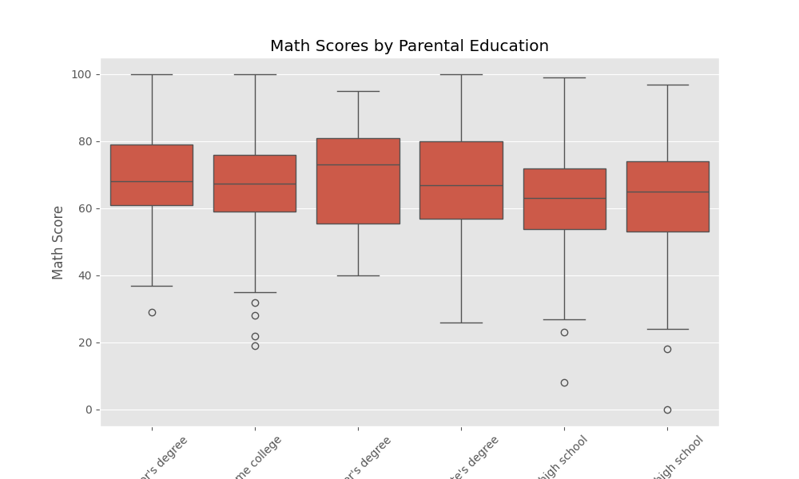
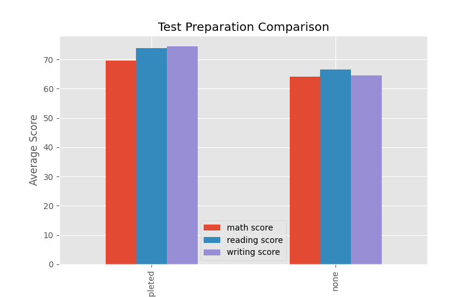
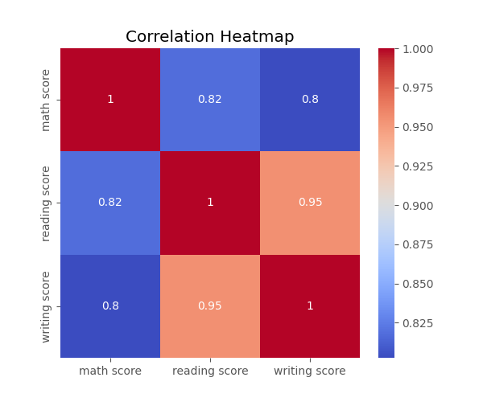
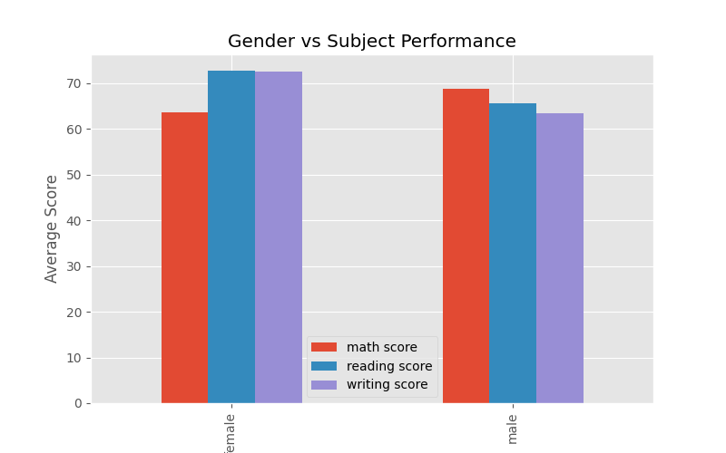
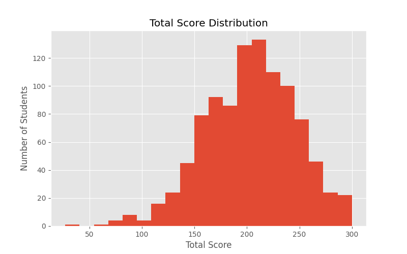
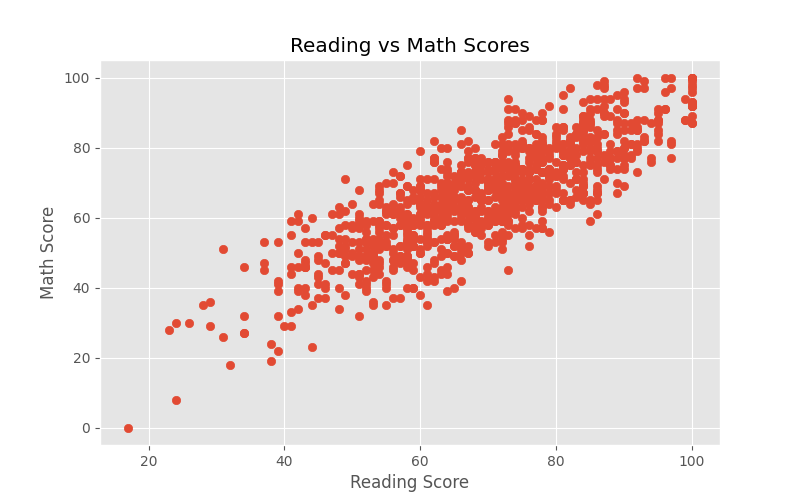

# Student-Performance-Analysis
## 📌 Project Overview

This project analyzes the **Students Performance in Exams** dataset using Python. The objective is to identify the factors that influence student performance, detect at-risk students, and provide actionable recommendations that can help improve academic outcomes.

---

## 🎯 Objectives

- Explore and clean the student dataset.
- Analyze factors affecting student performance.
- Identify at-risk students.
- Create visualizations to support findings.
- Provide recommendations for improving student performance.

---

## 🛠️ Tools & Technologies

- Python
- Pandas
- Matplotlib
- Seaborn
- Google Colab
- Git & GitHub

---

## 📂 Dataset

**Dataset:** Students Performance in Exams (Kaggle)

The dataset contains information about students including:
- Gender
- Race/Ethnicity
- Parental Level of Education
- Lunch Type
- Test Preparation Course
- Math Score
- Reading Score
- Writing Score

---

## 📊 Exploratory Data Analysis (EDA)

The following analyses were performed:

- Data Cleaning
- Missing Value Check
- Duplicate Check
- Data Type Verification
- Summary Statistics

---

# 📊 Visualizations

## 1. Scores by Parental Education

---

## 2. Test Preparation Comparison

---

## 3. Correlation Heatmap

---

## 4. Gender vs Subject Performance

---

## 5. Total Score Distribution

---

## 6. Reading vs Math Scores

---

## 🚨 At-Risk Student Segmentation

An at-risk student is defined as a student scoring **below 50 in Mathematics, Reading, or Writing**.

The project identifies:
- Total number of at-risk students
- At-risk percentage
- At-risk students by gender
- At-risk students by parental education level
- At-risk students by test preparation status

---

## 📋 Principal's Report Summary

### Executive Summary

The analysis explores the factors influencing student performance, including parental education, test preparation, and gender. The findings highlight key trends that can help the school improve academic outcomes and reduce the number of at-risk students.

### Key Findings

- Students whose parents have higher education levels generally performed better.
- Students who completed the test preparation course achieved higher scores.
- Reading, Writing, and Mathematics scores are strongly correlated.
- Female students performed better in Reading and Writing, while male students performed slightly better in Mathematics.
- A significant number of students were identified as at-risk.
# Student Performance Analysis

## Project Overview

This project is about analyzing the Students Performance in Exams dataset using Python. The main goal of this project is to figure out what factors affect student performance identify students who're at risk of doing poorly and provide suggestions that can help improve academic outcomes for Students Performance in Exams.

---

## Objectives

- We need to look at the student dataset and clean it up.

- We have to analyze the factors that affect Students Performance in Exams.

- We want to identify students who're at risk of doing poorly in Students Performance in Exams.

- We need to create visualizations to support our findings about Students Performance in Exams.

- We have to provide recommendations for improving Students Performance in Exams.

---

## Tools & Technologies

- We use Python for this project about Students Performance in Exams.

- We use Pandas to handle data for Students Performance in Exams.

- We use Matplotlib to create visualizations for Students Performance in Exams.

- We use Seaborn to create visualizations for Students Performance in Exams.

- We use Google Colab to work on the project about Students Performance in Exams.

- We use Git and GitHub to manage the project files for Students Performance in Exams.

---

## Dataset

The dataset we use is called Students Performance in Exams, which we got from Kaggle.

This dataset has information about students, including:

- Their gender

- Their race or ethnicity

- Their parents level of education

- The type of lunch they get

- Whether they took a test preparation course

- Their math score

- Their reading score

- Their writing score

---

## Exploratory Data Analysis

We did the following analyses for Students Performance in Exams:

- We cleaned the data for Students Performance in Exams.

- We checked for missing values in the dataset for Students Performance in Exams.

- We checked for values in the dataset for Students Performance in Exams.

- We verified the data types for Students Performance in Exams.

- We calculated summary statistics for Students Performance in Exams.

---

## Visualizations

The project includes the following visualizations for Students Performance in Exams:

- A box plot that shows scores by education for Students Performance in Exams.

- A bar chart that compares test preparation for Students Performance in Exams.

- A correlation heatmap for Students Performance in Exams.

- A grouped bar chart that shows gender versus subject for Students Performance in Exams.

- A histogram that shows the distribution of scores for Students Performance in Exams.

- A scatter plot that shows reading versus math scores for Students Performance in Exams.

---

## At-Risk Student Segmentation

We define an at-risk student as someone who scores below 50 in math reading or writing in Students Performance in Exams.

The project identifies:

- The number of at-risk students in Students Performance in Exams.

- The percentage of at-risk students in Students Performance in Exams.

- At-risk students by gender in Students Performance in Exams.

- At-risk students by education level in Students Performance in Exams.

- At-risk students by test preparation status in Students Performance in Exams.

---

## Principals Report Summary

### Executive Summary

The analysis looks at the factors that affect student performance in Students Performance in Exams including education, test preparation and gender.

The findings highlight trends that can help the school improve academic outcomes and reduce the number of at-risk students in Students Performance in Exams.

### Key Findings

- Students whose parents have education levels generally do better in Students Performance in Exams.

- Students who complete the test preparation course achieve higher scores in Students Performance in Exams.

- Reading, writing and math scores are strongly correlated in Students Performance in Exams.

- Female students do better in reading and writing while male students do slightly better in math in Students Performance in Exams.

- A significant number of students are identified as at-risk in Students Performance in Exams.

### Recommendations

- We should provide academic support for at-risk students in Students Performance in Exams.

- We should encourage students to participate in the test preparation course for Students Performance in Exams.

- We should increase engagement through workshops and regular communication for Students Performance in Exams.

---

## Impactful Recommendation

Encouraging students to complete the test preparation course is likely to have the greatest impact on Students Performance in Exams.

Students who complete the course consistently achieve scores across all three subjects in Students Performance in Exams making it an effective strategy for improving academic performance in Students Performance, in Exams.

---

## Project Files

- Student_Performance_Analysis.ipynb

- README.md

- Boxplot_Parental_Education.png

- TestPrep_Bar.png

- Correlation_Heatmap.png

- Gender_Subject.png

- TotalScore_Histogram.png

- Reading_vs_Math.png

---
### Recommendations

- Provide additional academic support for at-risk students.
- Encourage participation in the test preparation course.
- Increase parental engagement through workshops and regular communication.

---

## 💡 Most Impactful Recommendation

Encouraging students to complete the test preparation course is likely to have the greatest impact. Students who completed the course consistently achieved higher scores across all three subjects, making it an effective strategy for improving academic performance.

---

## 📁 Project Files

- Student_Performance_Analysis.ipynb
- README.md
- Boxplot_Parental_Education.png
- TestPrep_Bar.png
- Correlation_Heatmap.png
- Gender_Subject.png
- TotalScore_Histogram.png
- Reading_vs_Math.png

---

## 👩‍💻 Author

**Astha Singh**
